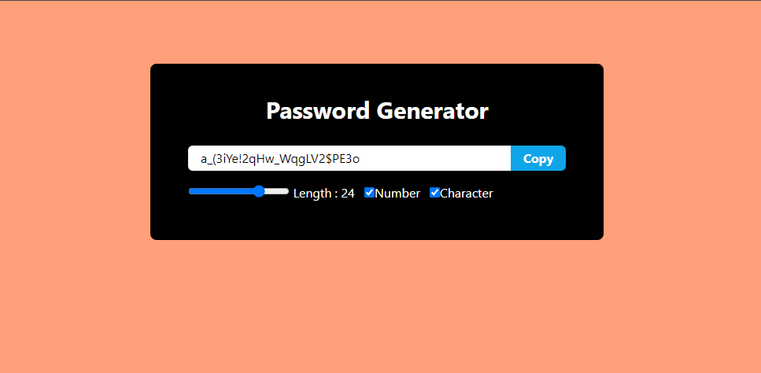

# Random Password Generator

😊 Welcome to the Random Password Generator repository! This project is built using React and JavaScript. With this project, you can generate random passwords with options to include numbers and special characters.

## Preview

## Getting Started

To get started with this project, follow these steps:

1. Clone this repository to your local machine.
2. Install dependencies by running `npm install`.
3. Run the project using `npm start`.
4. Open your browser and navigate to [http://localhost:3000](http://localhost:3000) to see the Random Password Generator in action.

## Features

- Random Password Generation: Generate random passwords of specified length.
- Include Numbers and Special Characters: Customize your password by including numbers and special characters.
- Copy Password to Clipboard: Easily copy the generated password to your clipboard for use.

### Usage

To generate a random password, adjust the length slider to your desired password length and check the options to include numbers and special characters as needed. Then, And you dont need to click any button to generate your password, It automatic generate on selecting.

## Contributing

If you want to contribute to this project, feel free to fork the repository and submit a pull request with your changes. Contributions are welcome!

## Credits

This project is maintained by softengrmuhammadnabeel.
